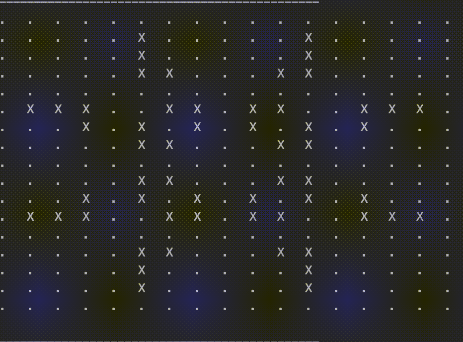

# Game of Life

The game is a zero-player game, meaning that its evolution is determined by its initial state, requiring no further input. One interacts with the Game of Life by creating an initial configuration and observing how it evolves.

This demo project takes the input as a file (or console input).

Sample input can be seen in file:
resources/input.txt

Follows the rules:

1. Any live cell with two or three neighbours survives.
2. Any dead cell with three live neighbours becomes a live cell.
3. All other live cells die in the next generation. Similarly, all other dead cells stay dead.

The demonstration for this specific input is shown below:

